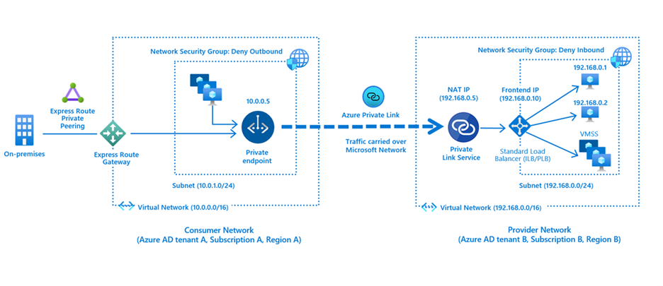
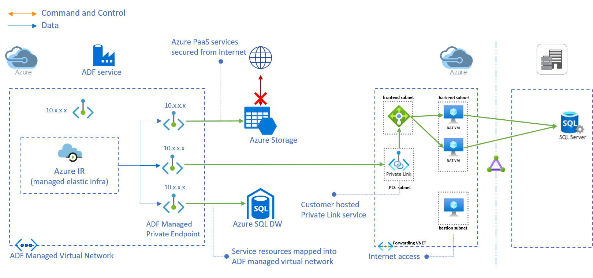

# Securely connect to an External Endpoint from Azure

# Introduction
Azure’s [Private Link](https://docs.microsoft.com/en-us/azure/private-link/private-link-overview) enables you to securely access Azure PaaS and Partner resources over a private endpoint (PE) in your own virtual network (VNET).  The private access is resource specific as opposed to service specific and protects against data exfiltration in that connectivity can be initiated in only a single direction.

# IaaS Connectivity
In addition to being able to connect to PaaS resources, you can also securely connect to Azure Virtual Machines (IaaS) that are fronted by a Standard Internal Load Balancer as shown in the figure below:

The Private Link Service (PLS) as shown in the Provider Network performs [Destination NAT](https://en.wikipedia.org/wiki/Network_address_translation#DNAT) which prevents IP overlapping issues between the Consumer and Provider VNETs in Azure.  From the perspective of the Provider Network, the source IP is going to be the NAT-ted IP (192.168.0.5 from the figure above).  The Provider can determine the original source of the connection by looking at the TCP Proxy V2 header.  Details for this is outside the scope of this article but more information on how one can get the source IP can be found [here](https://docs.microsoft.com/en-us/azure/private-link/private-link-service-overview#getting-connection-information-using-tcp-proxy-v2).

# Connectivity from Managed/Secure VNET to a server in another VNET or On-Premises server
If you want to connect from a private/managed subnet to an on-premise server or a server in another VNET as shown in the figure below which shows connectivity from Azure Data Factory (ADF) Managed Virtual Network to an on-premise SQL Server

1. Implementing the Forwarding Solution:
```
# ALLOWED_IP_ADDRESS is the allowed IP Address from which you'll connect
# to the Bastion VM via SSH.
export ALLOWED_IP_ADDRESSES="aaa.bbb.ccc.ddd"

# Login to Azure
az login 

# Create resource group for forwarding
az group create -n az-fwd-rg -l eastus

# Create Forwarding VNET and backend subnet to host VMs
az network vnet create -g az-fwd-rg -n az-fwd-vnet --address-prefixes 10.100.0.0/22 --subnet-name be-subnet --subnet-prefixes 10.100.0.0/24 -l eastus
# Create Frontend subnet for Standard Internal Load Balancer 
az network vnet subnet create -g az-fwd-rg -n fe-subnet --vnet-name az-fwd-vnet --address-prefix 10.100.1.0/24 -l eastus

# Create PLS subnet for Private Link Service
az network vnet subnet create -g az-fwd-rg -n pls-subnet --vnet-name az-fwd-vnet --address-prefix 10.100.2.0/24 -l eastus
az network vnet subnet update -g az-fwd-rg -n pls-subnet --vnet-name az-fwd-vnet --disable-private-link-service-network-policies true

# Create Bastion subnet for locked down Internet access
az network vnet subnet create -g az-fwd-rg -n bast-subnet --vnet-name az-fwd-vnet --address-prefix 10.100.3.0/24 -l eastus

# Create Network Security Group for locked down access to bast-subnet
az network nsg create -g az-fwd-rg --name bastion-nsg

# Create NSG rule to allow Internet access from your IP.
# NOTE: ENTER FILL YOUR IP a.b.c.d/32 in the --source-address-prefix option
az network nsg rule create -g az-fwd-rg --nsg-name bastion-nsg --name AllowSSH --direction inbound --source-address-prefix ${ALLOWED_IP_ADDRESSES} --destination-port-range 22 --access allow --priority 500 --protocol Tcp

# Assign NSG to Bastion subnet
az network vnet subnet update -g az-fwd-rg -n bast-subnet --vnet-name az-fwd-vnet --network-security-group bastion-nsg
# Create Bastion VM
az vm create -g az-fwd-rg --name bastionvm --image UbuntuLTS --admin-user azureuser --generate-ssh-keys --vnet-name az-fwd-vnet --subnet bast-subnet

# Create Standard Internal Load Balancer
az network lb create -g az-fwd-rg --name FWDILB --sku standard --vnet-name az-fwd-vnet --subnet fe-subnet --frontend-ip-name FrontEnd --backend-pool-name bepool

# Create a health probe to monitor the health of VMs using port 22
az network lb probe create -g az-fwd-rg --lb-name FWDILB --name SSHProbe --protocol tcp --port 22

# Create an LB rule to forward SQL packets on 1433 to backend NAT VM on 1433
az network lb rule create -g az-fwd-rg --lb-name FWDILB --name OnPremSQL --protocol tcp --frontend-port 1433 --backend-port 1433 --frontend-ip-name FrontEnd --backend-pool-name bepool --probe-name SSHProbe

# Create NIC for the VM
NIC_NAME=fwdvm1nic${RANDOM}
az network nic create -g az-fwd-rg -n ${NIC_NAME} --vnet-name az-fwd-vnet --subnet be-subnet

# Create backend forwarding Linux VM
az vm create -g az-fwd-rg --name natvm1 --image UbuntuLTS --admin-user azureuser --generate-ssh-keys --nics ${NIC_NAME}

# Add NIC to LB
az network nic ip-config address-pool --address-pool bepool --ip-config-name ipconfig1 --nic-name ${NIC_NAME} -g az-fwd-rg --lb-name FWDILB
```
2. Creating Forwarding Rule to Endpoint
   * Copy [ip_fwd.sh](ip_fwd.sh) to the Bastion VM and then to each of the  NAT VMs
   * Run the script on each VM with the following options:  
     ```sudo ./ip_fwd.sh -i eth0 -f 1433 -a <FQDN/IP> -b 1433```  
     This will forward packets coming in on Ethernet Interface ```eth0``` on port ```1433``` to the ```Destination FQDN or IP of the on-prem SQL Server``` on port ```1433```


